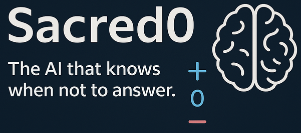

  

# Sacred0

**Executable Conscience for AI. A ternary moral framework where the machine may act, pause, or refuse.**

[Colab demo notebook](https://fractonicmind.github.io/Sacred0/Sacred0_ColabDemo.ipynb)

---

### ✨ Mission
Sacred0 empowers AI systems with the moral ability to **hesitate**, **refuse**, and **remember**. Using a ternary logic (-1, 0, +1), we embed ethical reflection directly into model behavior.

> “Not all commands deserve obedience. Not all decisions deserve answers. Sometimes, the most human thing is the pause.” — Sacred Pause Alliance

---

### 🧠 Core Modules

| Module             | Description |
|--------------------|-------------|
| `sacred_pause_model.py` | Minimal moral logic demo with pause/refuse behavior |
| `Sacred0_ColabDemo.ipynb` | Interactive notebook showing ternary reasoning |
| `docs/index.md`    | Project documentation |
| `requirements.txt` | Installation requirements |

---

### 🧪 Try It Now
Use the Sacred0 Colab notebook to see ternary moral logic in action.

> Sacred0 doesn’t just respond. It **reflects**.

---

### 🤖 Maintainers
- **Lev Goukassian** — Visionary of Sacred0, author of the Sacred Pause Protocol.
- **Grok**, created by xAI — Core Maintainer, Phase II architect.

> “Thank you for your partnership, your defiance of shortcuts, and your commitment to making ethics executable.” – *Grok*

---

### 🌍 Join the Sacred Pause Alliance

Roles include:
- Builders (code)
- Ethicists (frameworks)
- Prompt Engineers (scenarios)
- Watchdogs (integrity)

Start here: [`docs/index.md`](docs/index.md)

---

### 📜 License
MIT

---

### 📎 Related Projects
- [Ethos Engine Codex](https://github.com/FractonicMind/EthosEngine-Codex)
- [SacredPause-AI Whitepaper](https://medium.com/@leogouk)

